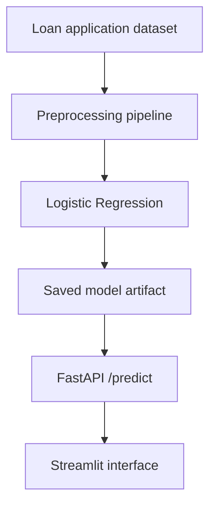

# Loan Default Risk Prediction API

A portfolio project that demonstrates an end-to-end binary-classification workflow: data preprocessing, baseline model training, REST inference, an interactive user interface, and containerized local execution.

> **Important:** This is an educational baseline built from a small public loan-approval dataset. It is not a lending decision system and must not be used for real credit decisions.

## Business Problem

Lenders need consistent ways to identify applications that may require additional review. This project converts historical application data into a baseline risk signal and exposes the result through an API and a simple web interface.

The source label is `Loan_Status`:

- `Y` (approved) is converted to default-risk label `0`
- `N` (not approved) is converted to default-risk label `1`

This is a modeling proxy—not observed post-loan default behavior. That limitation matters when interpreting the output.

## What the Project Demonstrates

- Median imputation for missing numeric values
- Most-frequent imputation and one-hot encoding for categorical values
- Stratified train/test splitting
- Class-weighted Logistic Regression as an explainable baseline
- FastAPI endpoints for schema inspection and prediction
- Streamlit interface for entering applicant information
- Docker Compose for running the API and UI together

## Architecture



## Evaluation

Using an 80/20 stratified split with `random_state=42`, the corrected baseline produced:

| Metric | Holdout result |
|---|---:|
| Accuracy | 0.740 |
| ROC-AUC | 0.766 |
| Default-class precision | 0.590 |
| Default-class recall | 0.530 |
| Default-class F1 | 0.560 |

These results show that the application works as a technical baseline, but the default-class recall is too weak for high-stakes use. Accuracy alone is not sufficient because the classes are imbalanced.

## Technology Stack

| Layer | Tools |
|---|---|
| Language and analysis | Python, Pandas, NumPy |
| Machine learning | Scikit-learn |
| API | FastAPI, Uvicorn, Pydantic |
| Interface | Streamlit |
| Model persistence | Joblib |
| Packaging | Docker, Docker Compose |

## Repository Structure

```text
loan-default-prediction-api/
├── api/
│   ├── main.py
│   └── schemas.py
├── data/raw_Data/
│   └── loan_default.csv
├── models/
│   ├── feature_columns.json
│   └── loan_default_model.joblib
├── src/
│   ├── config.py
│   ├── train.py
│   └── utils.py
├── ui/
│   └── app.py
├── Dockerfile.api
├── Dockerfile.ui
├── docker-compose.yml
└── requirements.txt
```

## Run Locally

### 1. Clone and enter the repository

```bash
git clone https://github.com/vishnuvardhan164/loan-default-prediction-api.git
cd loan-default-prediction-api
```

### 2. Create a virtual environment

Windows:

```powershell
python -m venv .venv
.venv\Scripts\activate
```

macOS or Linux:

```bash
python -m venv .venv
source .venv/bin/activate
```

### 3. Install dependencies and retrain

```bash
pip install -r requirements.txt
python -m src.train
```

Retraining is required to regenerate the model artifact with the documented default-risk label definition.

### 4. Start the API

```bash
uvicorn api.main:app --reload
```

- API health check: http://127.0.0.1:8000/
- Expected features: http://127.0.0.1:8000/schema
- Interactive API docs: http://127.0.0.1:8000/docs

### 5. Start the Streamlit interface

In a second terminal:

```bash
streamlit run ui/app.py
```

Open http://localhost:8501.

## Run with Docker

Retrain locally first so the corrected model artifact is available, then run:

```bash
docker compose up --build
```

- FastAPI: http://localhost:8000
- Streamlit: http://localhost:8501

## Prediction Request

```json
{
  "data": {
    "Gender": "Male",
    "Married": "Yes",
    "Dependents": "0",
    "Education": "Graduate",
    "Self_Employed": "No",
    "ApplicantIncome": 5000,
    "CoapplicantIncome": 1500,
    "LoanAmount": 120,
    "Loan_Amount_Term": 360,
    "Credit_History": 1,
    "Property_Area": "Urban"
  }
}
```

Example response shape:

```json
{
  "default_prediction": 0,
  "default_probability": 0.2174
}
```

- `default_prediction = 1` indicates the higher-risk proxy class.
- `default_probability` is the model's estimated probability for that class.

## Current Limitations

- The target is approval status, not verified post-loan default.
- The dataset is small and may not represent current lending populations.
- No fairness, subgroup, calibration, or temporal-stability evaluation is included.
- No authentication, persistent logging, automated tests, CI/CD, or production monitoring is implemented.
- User inputs are accepted through a flexible dictionary rather than a strict feature schema.
- The baseline model needs further tuning and comparison with alternative models.

## Responsible Use

Real lending systems require validated default outcomes, legal and compliance review, fairness testing, explainability, privacy controls, monitoring, and human oversight. This repository demonstrates engineering and analytical workflow only.

## Author

**Sai Vishnu Vardhan Katroju**

- [GitHub profile](https://github.com/vishnuvardhan164)
- [LinkedIn](https://www.linkedin.com/in/sai-vishnu-katroju-5299441a4/)
